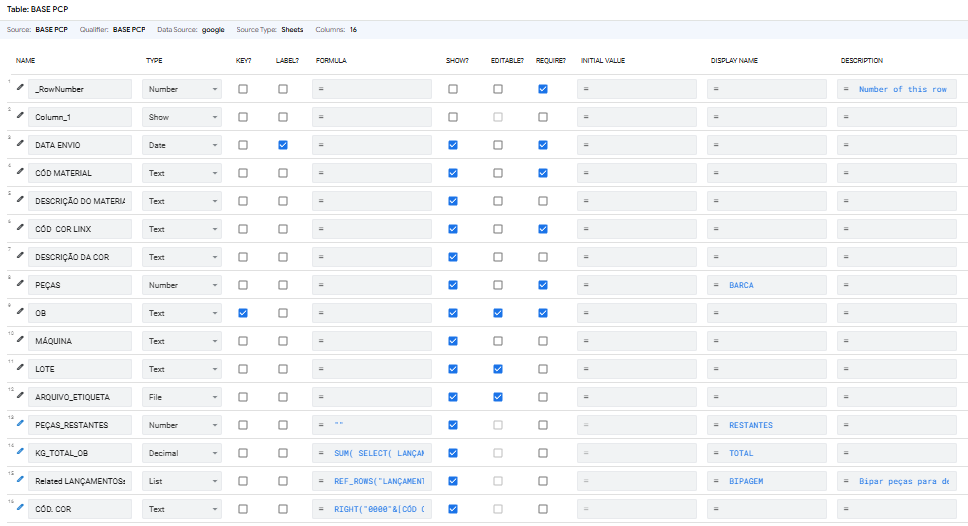
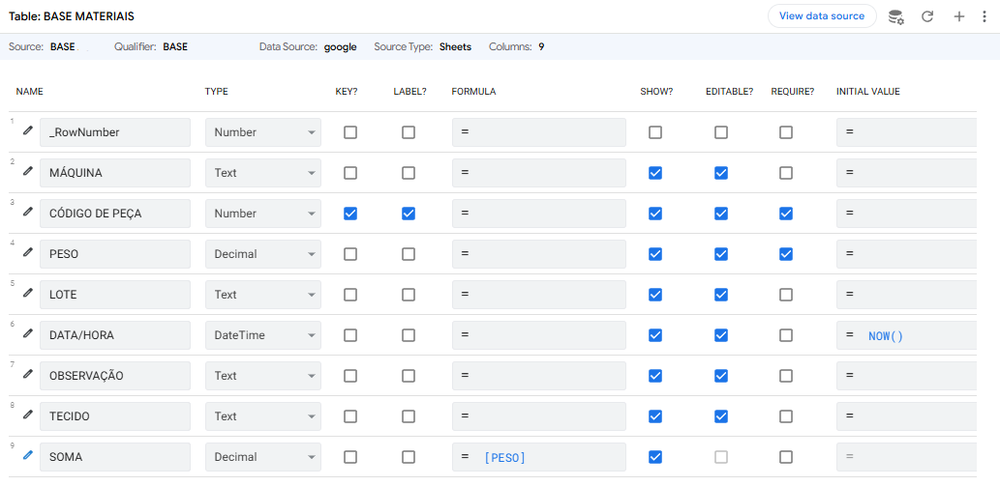

# Database Model

## Overview

The application is based on a simple but well-defined relational model.

Instead of storing all information in a single table, the data is separated according to its responsibility.

This approach improves maintainability, scalability and data consistency.

---

# Database Structure

The application consists of three primary tables.

```
BASE PCP
     │
     │ (Production Order)
     │
     ├──────────────┐
     │              │
     ▼              │
LANÇAMENTOS         │
     ▲              │
     │              │
     └──────────────┘
            │
            ▼
BASE MATERIAIS
```

<p align="center">
  
</p>

<p align="center">
  
</p>

# BASE PCP

This table stores every Production Order (OB).

Each row represents one order waiting to be processed.

The information contained here defines what the operator is expected to scan.

Typical information includes:

- Production Order (OB)
- Material
- Machine
- Lot
- Color
- Required Quantity (Barca)
- Total Weight

This table represents the business objective.

---

# BASE MATERIAIS

This table contains the master data for every material available for scanning.

Each row represents one individual piece.

Typical information includes:

- Barcode
- Machine
- Lot
- Weight
- Material
- Color
- Production Date

This table is never modified during the expedition process.

It serves as the validation source.

---

# LANÇAMENTOS

This table records every successful barcode scan.

Each row represents one scanned piece.

Typical information includes:

- Unique ID
- Production Order
- Barcode
- Operator
- Timestamp
- Material
- Color
- Weight

Unlike the other tables, this one grows continuously as operators perform scans.

It represents the operational history of the application.

---

# Relationships

The application uses a parent-child relationship.

```
Production Order

        │

        ▼

Multiple Scan Records
```

One Production Order can have many scan records.

Each scan record belongs to exactly one Production Order.

---

# Data Flow

The application follows the flow below.

```
Operator

    │

    ▼

Scan Barcode

    │

    ▼

Search Material

(BASE MATERIAIS)

    │

    ▼

Validate

    │

    ▼

Create Record

(LANÇAMENTOS)

    │

    ▼

Update Production Order

(BASE PCP)

    │

    ▼

Check Required Quantity

    │

    ▼

Generate Labels
```

---

# Design Decisions

The database was intentionally divided into three datasets.

This separation provides several advantages.

## BASE PCP

Responsible for business planning.

---

## BASE MATERIAIS

Responsible for validation.

---

## LANÇAMENTOS

Responsible for historical records.

---

This architecture avoids duplicated information and keeps each dataset focused on a single responsibility.
