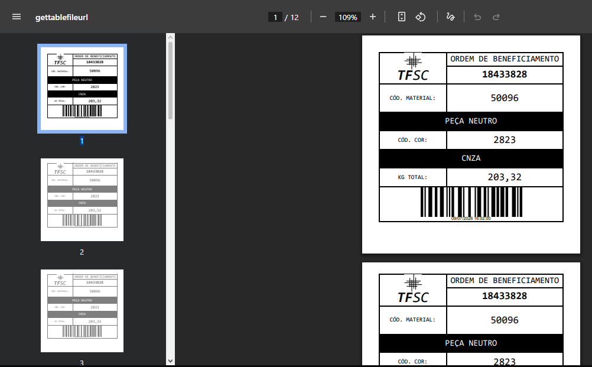

# Label Generation

<p align="center">
  
</p>

## Overview

The application automatically generates shipment labels when a Production Order reaches its required quantity.

This process is fully automated and does not require manual intervention from the operator.

The generated document is a PDF containing one or more labels ready for printing.

---

# Trigger

The label generation process starts automatically when the number of successfully scanned pieces matches the required quantity defined by the Production Order (Barca).

This event is monitored continuously during the expedition process.

---

# Data Source

The PDF template retrieves information from the completed Production Order and its associated scan records.

The document is populated automatically using data already stored by the application.

---

# Label Content

Each generated label contains operational information required by the production process.

Typical information includes:

- Production Order (OB)
- Material Code
- Material Description
- Color Code
- Color Description
- Total Weight
- Unique Barcode

---

# Unique Identification

Every generated label contains a unique barcode.

This identifier allows the shipment to be tracked after the expedition has been completed.

The barcode acts as the primary traceability element of the generated document.

---

# Document Creation

Once the trigger conditions are satisfied, the application:

1. Loads the PDF template.
2. Retrieves the Production Order information.
3. Populates all dynamic fields.
4. Generates the final PDF.
5. Stores the generated file.
6. Associates the document with the Production Order.

---

# Output

The final result is a printable PDF document containing the labels for the completed expedition.

The generated document becomes available directly from the application.

---

# Process Flow

```text
Production Order Completed
            │
            ▼
Load PDF Template
            │
            ▼
Retrieve Production Data
            │
            ▼
Populate Template
            │
            ▼
Generate PDF
            │
            ▼
Store File
            │
            ▼
Associate File with Production Order
            │
            ▼
Ready for Printing
```

---

# Traceability

The generated labels are part of the expedition record.

By combining Production Order information with a unique barcode, the application provides a reliable way to identify and trace completed shipments.

---

# Business Value

Automating label generation eliminates repetitive manual work, reduces printing errors and ensures that every completed expedition produces a standardized output ready for use in the production environment.
